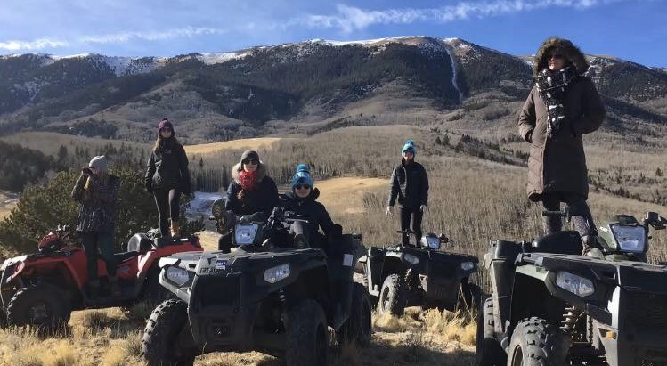

---
---

# About Me

<link rel="stylesheet" href="styles.css" type="text/css">

 My interest is in using data as a tool to answer research questions and test hypotheses. Previously, I investigated statistical and analytical tools at Appalachian State University. I graduated in May 2019 with a Bachelor's degree in Mathematics, a concentration in Physics, and a minor in Statistics. Through my time at App State, I developed a passion for programming and analyzing data. Currently, I am looking for opportunities that will enable me to grow and utilize my experience and skills with mathematics, statistics, and programming. 

### Additional Interests
 
*  cooking 
*  snowboarding 
*  rock climbing 
*  hiking  

